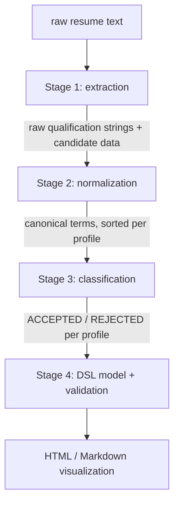

# Design — Modules

This document lays out how the four stages of ResumeLens are split into functions before any of
them gets implemented. The idea is to keep every stage as a pure transformation — it takes the
output of the previous stage and returns something the next one can consume — so the four
stages can be tested on their own and the pipeline module just has to wire them together in
order.

## Pipeline flow

A résumé goes in as plain text and comes out the other end as a classification result plus a
rendered profile page. Nothing in between mutates global state; each stage returns a new value.

The boundary between stages 1 and 2 matters: extraction only pulls out strings as they appear
in the text (`JS`, `React.js`, `NodeJS`...). It has no notion of what those strings mean or
whether they're equivalent to one another — that's entirely normalization's job. Keeping that
line strict is what lets stage 1 and stage 2 be tested independently.

## `resumelens.extraction`

Input to every function here is the raw résumé text. Output is always a plain Python structure
(list or dict of strings) — no normalization, no interpretation, just what the regex matched.

| Function | Signature | Returns |
|---|---|---|
| Contact info | `extract_contact_info(text: str) -> dict` | `{"email": str \| None, "phone": str \| None, "linkedin": str \| None, "github": str \| None}` |
| Years of experience | `extract_experience_years(text: str) -> int \| None` | number of years stated, or `None` if not found |
| Programming languages | `extract_languages(text: str) -> list[str]` | raw language mentions, e.g. `["JS", "Python"]` |
| Frameworks & libraries | `extract_frameworks(text: str) -> list[str]` | raw framework/library mentions, e.g. `["React.js", "Scikit-learn"]` |
| Databases | `extract_databases(text: str) -> list[str]` | raw database mentions, e.g. `["Postgres", "MongoDB"]` |
| Cloud & DevOps tools | `extract_cloud_tools(text: str) -> list[str]` | raw mentions, e.g. `["Docker", "AWS", "Terraform"]` |
| Data engineering tools | `extract_data_tools(text: str) -> list[str]` | raw mentions, e.g. `["Airflow", "Kafka", "Snowflake"]` |
| Academic qualifications | `extract_education(text: str) -> list[dict]` | one dict per degree found: `{"degree": str, "field": str \| None}` |
| Tools & version control | `extract_tools(text: str) -> list[str]` | e.g. `["Git"]`, plus anything not covered above |
| Everything at once | `extract_all(text: str) -> dict` | calls all of the above and merges the results into one dict keyed by category |

`extract_all` is what the pipeline actually calls; the individual functions exist so each one
can have its own unit tests and its own regex documented in `formalization_regex.md`.

## `resumelens.normalization`

| Function | Signature | Returns |
|---|---|---|
| Normalize | `normalize(raw_terms: list[str]) -> list[str]` | canonical terms, each one passed through the matching transducer; a term none of the transducers recognize is dropped, since an unrecognized term can't be part of any profile's alphabet in stage 3 anyway |
| Canonical ordering | `sort_by_profile_order(terms: list[str], profile: str) -> list[str]` | the same terms reordered according to the profile's defined category order (see `formalization_fst.md`) |

`normalize` doesn't know which profile it's dealing with — it just maps each raw string to its
canonical form. The profile only comes into play in `sort_by_profile_order`, which is what makes
the final sequence comparable against a fixed-alphabet automaton regardless of how the candidate
originally listed their skills.

## `resumelens.classification`

| Function | Signature | Returns |
|---|---|---|
| Classify | `classify(normalized_terms: list[str]) -> dict[str, str]` | one entry per supported profile, each `"ACCEPTED"` or `"REJECTED"`, e.g. `{"FULL_STACK_DEVELOPER": "ACCEPTED", "MACHINE_LEARNING_ENGINEER": "REJECTED", "DEVOPS_ENGINEER": "REJECTED", "DATA_ENGINEER": "REJECTED"}`. Takes the normalized, unsorted list: each profile sorts it with its own canonical order before running its automaton. |

Internally this runs the sequence against the four automata (one per profile) built in
`automata.py` and just collects whether each one accepted it. A candidate can be accepted into
more than one profile at once — that's expected, not a bug, given the overlap documented in
`docs/profiles.md`.

## `resumelens.dsl`

| Function | Signature | Returns |
|---|---|---|
| Build model | `build_candidate_model(extracted: dict, normalized: list[str], classification: dict) -> CandidateModel` | an in-memory textX model instance assembled from the previous three stages |
| Validate | `validate(model: CandidateModel) -> tuple[bool, list[str]]` | whether the model conforms to the grammar, plus a list of error messages if it doesn't |
| Render HTML | `render_html(model: CandidateModel) -> str` | HTML page for the candidate |
| Render Markdown | `render_markdown(model: CandidateModel) -> str` | Markdown equivalent, for cases where HTML isn't needed |

## `resumelens.pipeline`

| Function | Signature | Returns |
|---|---|---|
| Run | `run(text: str) -> PipelineResult` | a small dataclass holding the output of each of the four stages plus the final rendered page, so tests and the UI can inspect intermediate results without re-running the pipeline |

## `resumelens.ui`

A thin CLI wrapper: `python -m resumelens.ui.cli <path_to_resume.txt>` calls
`pipeline.run()`, prints the result of each stage to the terminal, and writes the rendered HTML
to disk next to the input file. No web UI is planned unless there's time left after stage 4 is
done — the CLI is enough to demonstrate the full pipeline end to end.
