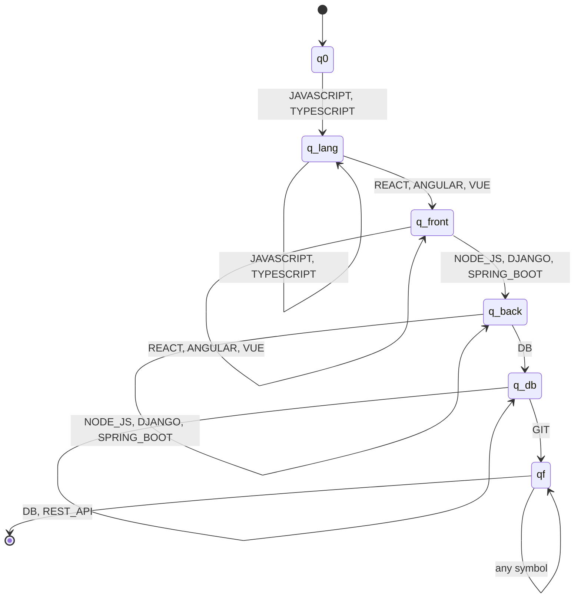
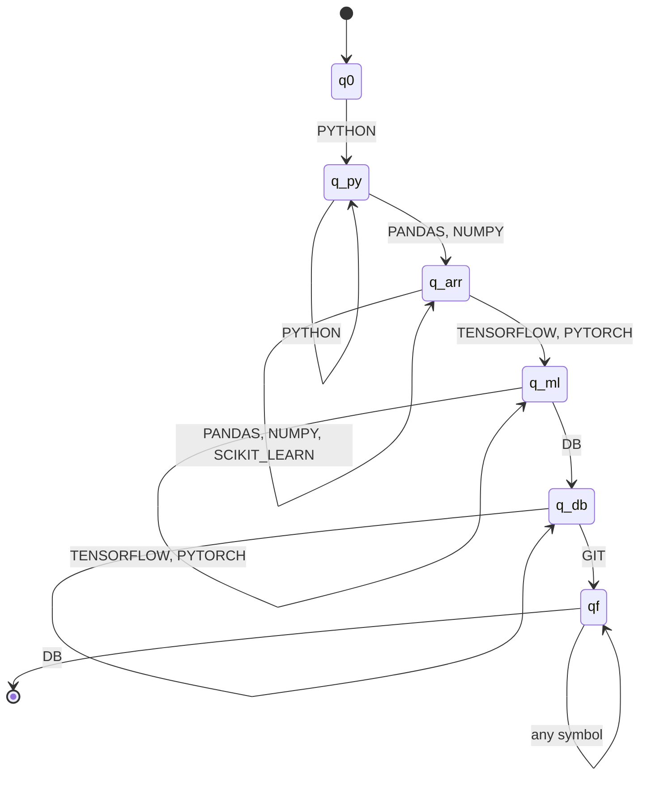
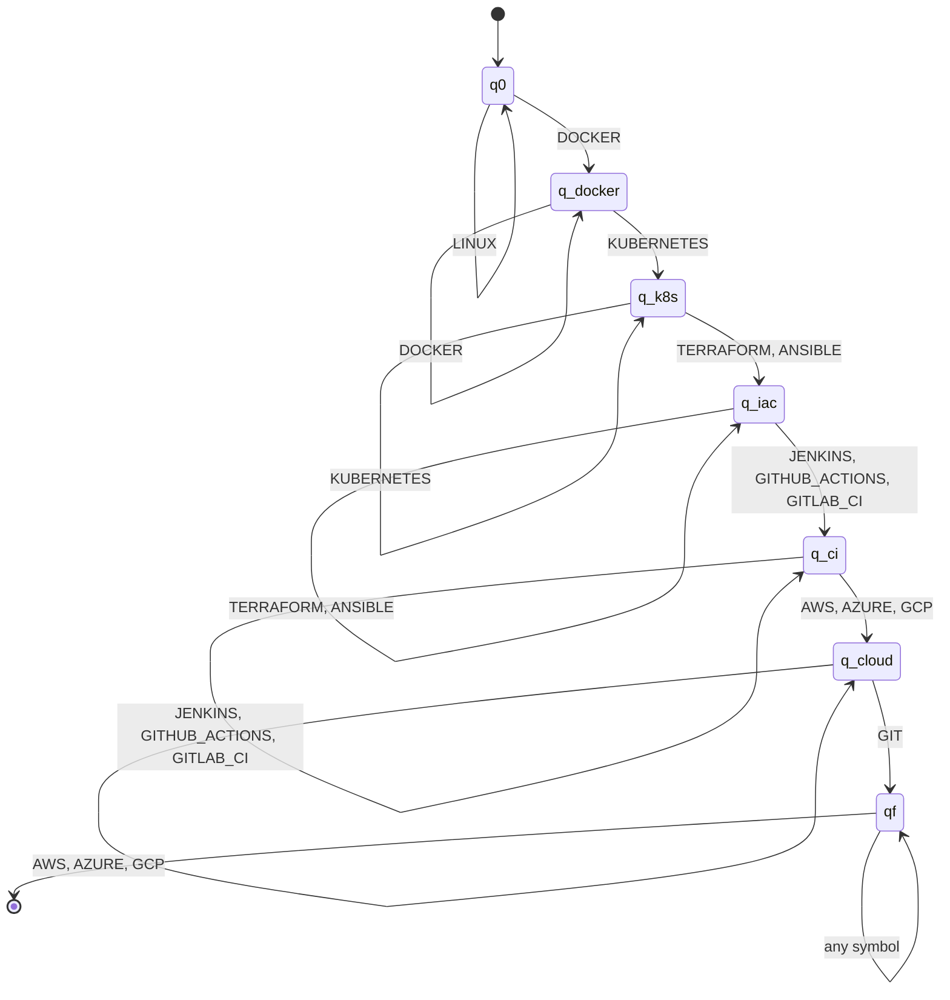
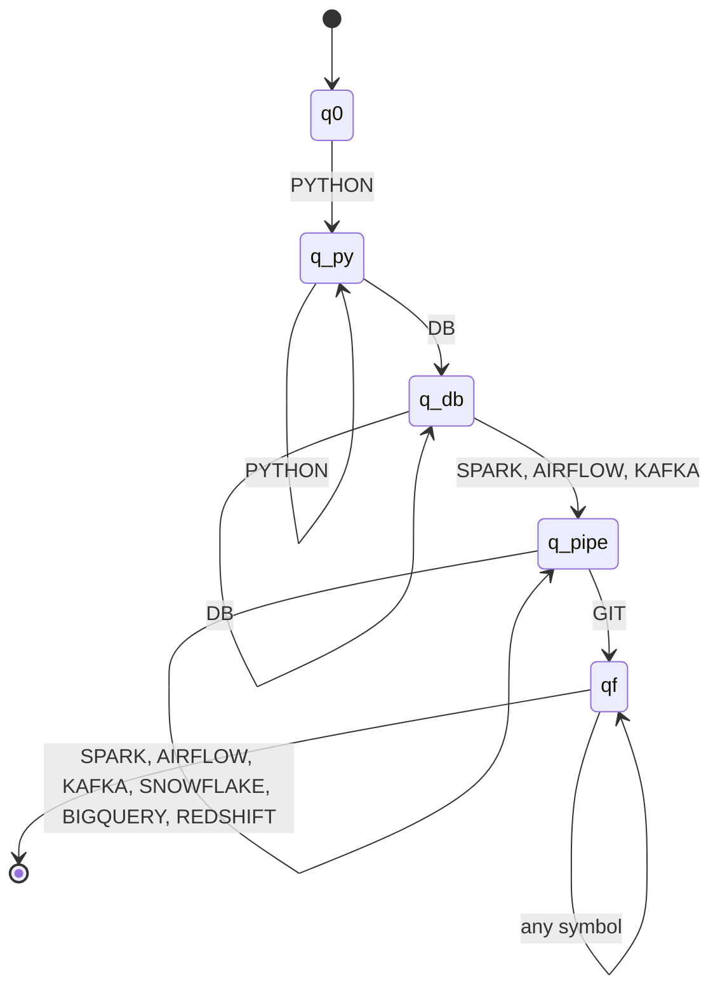

# Formalization — Stage 3: Finite Automata

For each profile: the complete 5-tuple M = (Q, Σ, δ, q0, F), the automaton type (DFA/NFA/NFA-λ)
with justification, a transition diagram, an explanation of the pattern it represents, and a
pointer to its implementation in `resumelens/classification/automata.py` (pyformlang).

Following the notation used in class (see `class_notation_reference.md`): the transition
relation is written **δ** when it is a function Q × Σ → Q (deterministic) and **Δ** when it is a
relation Q × Σ → ℘(Q) (non-deterministic). λ-transitions extend the domain to Q × (Σ ∪ {λ}); an
automaton with them is an **NFA-λ**, not an "ε-NFA".

## Why all four profiles end up as DFAs

The activity description explicitly allows DFA, NFA, or NFA-λ, so this was an actual design
decision, not a default — here's the reasoning that led to a DFA for all four.

A finite automaton needs genuine non-determinism (Δ instead of δ) only when the same symbol,
read from the same state, could legitimately lead to more than one next state — i.e. the machine
would have to guess, or try several paths at once. That happens in two common situations:
either two categories of qualification share a symbol (ambiguous meaning), or the input could
arrive in more than one relative order (so the automaton doesn't know yet which "slot" a symbol
is filling). Neither holds here:

- Every canonical term produced by stage 2 belongs to exactly one category for a given profile
  (`JAVASCRIPT` is always "language", never "framework"), so there's no symbol that could mean
  two different things depending on path taken.
- `sort_by_profile_order` (stage 2) already arranges each candidate's terms into the profile's
  canonical category order before stage 3 ever sees them. The automaton is never handed a
  sequence where, say, a database term shows up before the backend framework — stage 2 already
  ruled that out. So the automaton doesn't need to branch and backtrack to figure out "is this
  the frontend slot or did I misread the order" — there's only ever one slot it could be.

Because of that, every state in the automata below has at most one outgoing transition per
symbol — multiple arrows leaving the same state (e.g. one for `PANDAS`, one for `NUMPY`, both
landing on the same next state) are still a function, not a relation: δ(q, PANDAS) and
δ(q, NUMPY) are just two different, unambiguous entries of the same δ. This is exactly the shape
of the automaton in the assignment's own stage 3 example (parallel `PANDAS`/`NUMPY` edges into
the same state) — which is itself a DFA by this same reasoning, even though the assignment
doesn't label it explicitly.

Where NFA or NFA-λ would actually be the right tool: if stage 2 didn't enforce a canonical
order (the automaton would have to try matching a symbol against several possible slots at
once), or if two profiles' alphabets shared a symbol with different roles. Neither applies to
ResumeLens as designed, which is itself a conclusion worth stating rather than forcing
non-determinism in just to use it.

One more consequence of δ being a genuine function: it's **partial**, not total. A state only
has transitions defined for the symbols that make sense at that point in the pattern; any other
symbol has no defined transition, which models rejection directly — the same way an unrecognized
term in stage 2 just has no transition and gets dropped.

## Shared alphabet

All four automata share the same Σ — the full set of canonical terms stage 2 can produce (the
union of every transducer's Γ from `formalization_fst.md`):

```
Σ = { JAVASCRIPT, TYPESCRIPT, PYTHON, JAVA, CPP, CSHARP, GO, RUBY, PHP, BASH,
      REACT, ANGULAR, VUE, NODE_JS, DJANGO, SPRING_BOOT, FLASK, EXPRESS,
      PANDAS, NUMPY, SCIKIT_LEARN, TENSORFLOW, PYTORCH, KERAS,
      SQL, NOSQL, POSTGRESQL, MYSQL, MONGODB, SQLITE, REDIS, CASSANDRA,
      DOCKER, KUBERNETES, TERRAFORM, ANSIBLE, JENKINS, GITHUB_ACTIONS, GITLAB_CI,
      AWS, AZURE, GCP, LINUX,
      SPARK, AIRFLOW, KAFKA, SNOWFLAKE, BIGQUERY, REDSHIFT,
      GIT, REST_API }
```

A shorthand used in all four transition tables below: **DB** = {SQL, NOSQL, POSTGRESQL, MYSQL,
MONGODB, SQLITE, REDIS, CASSANDRA}. Every profile that cares about a database treats any of
these eight interchangeably — this came directly out of the assignment's own ML Engineer
example, which accepts `POSTGRESQL` even though `profiles.md` only lists "SQL" for that profile.
Once one real example shows a database product standing in for the generic term, the honest
thing is to accept the whole category everywhere a database qualification matters, not just the
literal word "SQL".

In every automaton below, the accepting state `qf` has a self-loop on **all** of Σ. That's what
lets a candidate with qualifications beyond what the profile requires still get accepted — the
automaton is checking that the required pattern appears as a prefix of the canonical, sorted
sequence, not that the sequence contains nothing else. `sort_by_profile_order` guarantees that
anything not part of the profile's pattern ends up after everything that is, so "prefix" and
"the parts that matter" line up.

---

## Automaton 1 — Full Stack Developer

- **Q** = {q0, q_lang, q_front, q_back, q_db, qf}
- **Σ**: shared alphabet above
- **q0**: initial state
- **F** = {qf}
- **Type**: DFA — every (state, symbol) pair below maps to exactly one state.

| state | on symbol(s) | → state |
|---|---|---|
| q0 | JAVASCRIPT, TYPESCRIPT | q_lang |
| q_lang | JAVASCRIPT, TYPESCRIPT | q_lang (self-loop) |
| q_lang | REACT, ANGULAR, VUE | q_front |
| q_front | REACT, ANGULAR, VUE | q_front (self-loop) |
| q_front | NODE_JS, DJANGO, SPRING_BOOT | q_back |
| q_back | NODE_JS, DJANGO, SPRING_BOOT | q_back (self-loop) |
| q_back | DB | q_db |
| q_db | DB, REST_API | q_db (self-loop) |
| q_db | GIT | qf |
| qf | any symbol in Σ | qf (self-loop) |



**Pattern represented:** at least one frontend language, followed by at least one frontend
framework, followed by at least one backend framework, followed by at least one database
qualification (REST API is recognized but doesn't advance the state, matching how it's the one
qualification in `profiles.md` that isn't always spelled out explicitly in a résumé), followed by
Git.

---

## Automaton 2 — Machine Learning Engineer

- **Q** = {q0, q_py, q_arr, q_ml, q_db, qf}
- **Σ**: shared alphabet above
- **q0**: initial state
- **F** = {qf}
- **Type**: DFA, same reasoning as automaton 1.

| state | on symbol(s) | → state |
|---|---|---|
| q0 | PYTHON | q_py |
| q_py | PYTHON | q_py (self-loop) |
| q_py | PANDAS, NUMPY | q_arr |
| q_arr | PANDAS, NUMPY, SCIKIT_LEARN | q_arr (self-loop) |
| q_arr | TENSORFLOW, PYTORCH | q_ml |
| q_ml | TENSORFLOW, PYTORCH | q_ml (self-loop) |
| q_ml | DB | q_db |
| q_db | DB | q_db (self-loop) |
| q_db | GIT | qf |
| qf | any symbol in Σ | qf (self-loop) |



**Pattern represented:** Python, followed by a data-handling library (Pandas or NumPy — Scikit-
learn is recognized in that same slot but, like REST API in automaton 1, doesn't gate progress
to the next slot, since the assignment's own worked example is accepted without it), followed by
a model-building library (TensorFlow or PyTorch), followed by a database qualification, followed
by Git. This reproduces the assignment's own example exactly: `PYTHON, PANDAS, TENSORFLOW,
POSTGRESQL, GIT` is accepted without ever visiting a `SCIKIT_LEARN` transition.

---

## Automaton 3 — DevOps Engineer

- **Q** = {q0, q_docker, q_k8s, q_iac, q_ci, q_cloud, qf}
- **Σ**: shared alphabet above
- **q0**: initial state
- **F** = {qf}
- **Type**: DFA, same reasoning as automaton 1.

| state | on symbol(s) | → state |
|---|---|---|
| q0 | LINUX | q0 (self-loop — optional, doesn't gate anything) |
| q0 | DOCKER | q_docker |
| q_docker | DOCKER | q_docker (self-loop) |
| q_docker | KUBERNETES | q_k8s |
| q_k8s | KUBERNETES | q_k8s (self-loop) |
| q_k8s | TERRAFORM, ANSIBLE | q_iac |
| q_iac | TERRAFORM, ANSIBLE | q_iac (self-loop) |
| q_iac | JENKINS, GITHUB_ACTIONS, GITLAB_CI | q_ci |
| q_ci | JENKINS, GITHUB_ACTIONS, GITLAB_CI | q_ci (self-loop) |
| q_ci | AWS, AZURE, GCP | q_cloud |
| q_cloud | AWS, AZURE, GCP | q_cloud (self-loop) |
| q_cloud | GIT | qf |
| qf | any symbol in Σ | qf (self-loop) |



**Pattern represented:** Docker, followed by Kubernetes, followed by an infrastructure-as-code
tool, followed by a CI/CD tool, followed by a cloud provider, followed by Git. Linux is
recognized at the very start but is purely optional — it loops back on `q0` without requiring
the rest of the chain to wait for it, which matters in practice since container/cloud tooling
implies a Linux environment without every résumé spelling it out (see `michael_scott.txt`, who
is accepted without ever mentioning Linux).

---

## Automaton 4 — Data Engineer

- **Q** = {q0, q_py, q_db, q_pipe, qf}
- **Σ**: shared alphabet above
- **q0**: initial state
- **F** = {qf}
- **Type**: DFA, same reasoning as automaton 1.

| state | on symbol(s) | → state |
|---|---|---|
| q0 | PYTHON | q_py |
| q_py | PYTHON | q_py (self-loop) |
| q_py | DB | q_db |
| q_db | DB | q_db (self-loop) |
| q_db | SPARK, AIRFLOW, KAFKA | q_pipe |
| q_pipe | SPARK, AIRFLOW, KAFKA, SNOWFLAKE, BIGQUERY, REDSHIFT | q_pipe (self-loop) |
| q_pipe | GIT | qf |
| qf | any symbol in Σ | qf (self-loop) |



**Pattern represented:** Python, followed by a database qualification, followed by at least one
data-pipeline tool (any combination of Spark, Airflow, and Kafka, in any count — a data warehouse
product is recognized in that same slot but is optional, same role as Scikit-learn in automaton
2), followed by Git.

---

## Worked examples — classification of all ten sample résumés

Computed by running each résumé through stages 1 and 2, then checking it against all four
automata (full simulation, matching what `resumelens/classification/automata.py` will implement
in pyformlang):

| Résumé | Sorted sequence (per matching profile) | Accepted profile(s) |
|---|---|---|
| `wednesday_addams.txt` | JAVASCRIPT, REACT, NODE_JS, POSTGRESQL, GIT | FULL_STACK_DEVELOPER |
| `mary_jane_watson.txt` | PYTHON, PANDAS, NUMPY, SCIKIT_LEARN, TENSORFLOW, SQL, GIT | MACHINE_LEARNING_ENGINEER |
| `peter_parker.txt` | TYPESCRIPT, ANGULAR, SPRING_BOOT, MONGODB, REST_API, GIT | FULL_STACK_DEVELOPER |
| `tony_stark.txt` | LINUX, DOCKER, KUBERNETES, TERRAFORM, JENKINS, AWS, GIT | DEVOPS_ENGINEER |
| `michael_scott.txt` | DOCKER, KUBERNETES, ANSIBLE, GITHUB_ACTIONS, AZURE, GIT | DEVOPS_ENGINEER |
| `hermione_granger.txt` | PYTHON, SQL, SPARK, AIRFLOW, SNOWFLAKE, GIT | DATA_ENGINEER |
| `walter_white.txt` | PYTHON, SQL, KAFKA, BIGQUERY, REDSHIFT, GIT | DATA_ENGINEER |
| `daenerys_targaryen.txt` | FS: JAVASCRIPT, REACT, NODE_JS, POSTGRESQL, GIT — DevOps: DOCKER, KUBERNETES, TERRAFORM, JENKINS, AWS, GIT | FULL_STACK_DEVELOPER, DEVOPS_ENGINEER |
| `eleven.txt` | ML: PYTHON, PANDAS, SCIKIT_LEARN, TENSORFLOW, SQL, GIT — DataEng: PYTHON, SQL, SPARK, AIRFLOW, GIT | MACHINE_LEARNING_ENGINEER, DATA_ENGINEER |
| `rick_sanchez.txt` | PYTHON, BASH, GIT (no automaton's required chain is completed) | *(none)* |

`daenerys_targaryen.txt` and `eleven.txt` were deliberately built to satisfy two profiles at
once — each has the full required chain for both, which is what makes them useful test cases for
automaton 6 (C6) in `test_cases.md`: a candidate isn't limited to a single matching profile, and
the four automata are checked independently, not as mutually exclusive branches of one bigger
machine. `rick_sanchez.txt` never advances past the first required transition for any profile
(too few qualifications), which is exactly the intended "insufficient profile" case.
