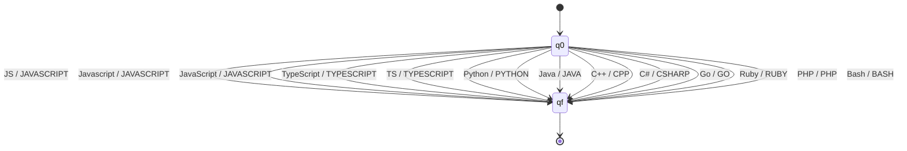
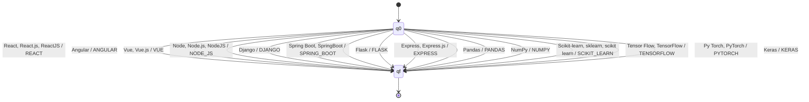
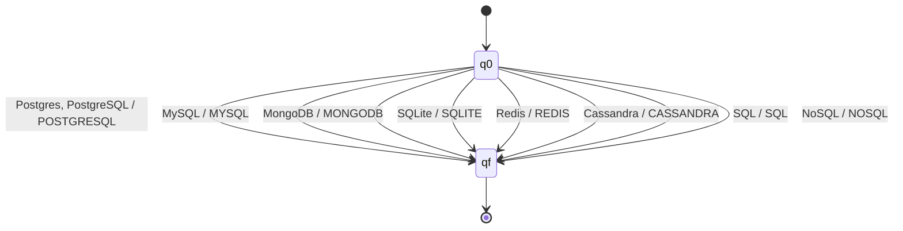
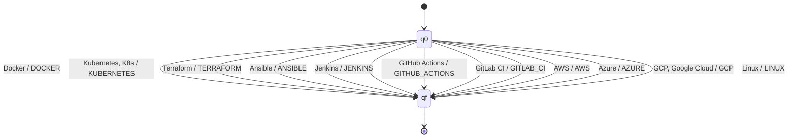
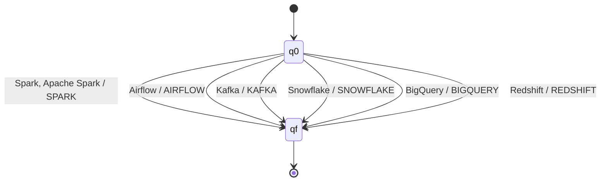
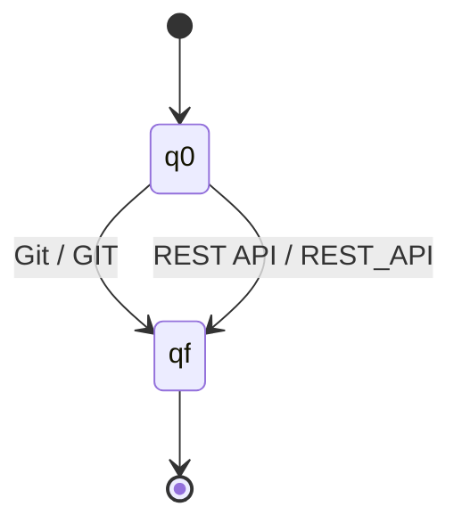

# Formalization — Stage 2: Finite-State Transducers

For each transducer: the complete 7-tuple M = (Q, Σ, Γ, δ, ω, q0, F), a diagram, and a pointer
to its implementation in `resumelens/normalization/transducers.py` (pyformlang).

This matches the definition used in class (see `class_notation_reference.md`) exactly, including
the tuple order. Per that definition: δ : Q × (Σ ∪ {λ}) → Q and ω : Q × (Σ ∪ {λ}) → Γ for a
deterministic FST; for a non-deterministic one, δ : Q × (Σ ∪ {λ}) → ℘(Q) and
ω : Q × (Σ ∪ {λ}) → Γ ∪ {λ}. Use λ (not ε) consistently, same as the automata docs.

## Design decision: one transition per token, not per character

Stage 1 already splits a résumé into discrete qualification strings (`"JS"`, `"React.js"`,
`"Postgres"`, ...). By the time stage 2 sees them, there's no reason to process a term
character by character — the normalization problem is lexical substitution (map a whole token
to its canonical spelling), not pattern matching inside a string. So every transducer below uses
the same shape: two states, `q0` and `qf`, and one transition per recognized synonym, each
reading the *entire* raw token in a single step and emitting the canonical term as its output.
This is the same thing the professor's own FST example does with whole-syllable transitions
(`"llor"`, `"ar"`) instead of single characters — pyformlang places no restriction on how long an
input symbol string is.

This also gives a direct, intuitive meaning to the accepting state: **a token is successfully
normalized if and only if reading it leaves the machine in `qf`.** If a token isn't one of the
recognized synonyms, no transition is defined for it, the machine stays stuck in `q0`
(non-accepting), and that's exactly the "term not recognized" case from `test_cases.md` (N2) —
rejection isn't a special case to code around, it falls directly out of δ being a **partial**
function.

One more modeling note: stage 1's regexes are case-insensitive, so the raw string captured for,
say, Python could show up as `Python`, `python`, or `PYTHON` depending on how the candidate wrote
it. Rather than listing every casing variant in Σ, each Σ below lists the representative spelling
pyformlang will be configured to look for, and the implementation normalizes case (`.strip()` +
lowercase comparison) before the lookup. That keeps Σ finite and readable here while still
handling arbitrary capitalization in practice — a theory/implementation gap that's worth being
explicit about rather than pretending Σ has one entry per possible casing.

---

## Transducer 1 — Programming Language Normalizer

- **Q** = {q0, qf}
- **Σ** = {JS, Javascript, JavaScript, TypeScript, TS, Python, Java, C++, C#, Go, Ruby, PHP, Bash}
- **Γ** = {JAVASCRIPT, TYPESCRIPT, PYTHON, JAVA, CPP, CSHARP, GO, RUBY, PHP, BASH}
- **q0**: initial state
- **F** = {qf}
- **δ / ω** (both share the domain Q × Σ, and every transition starts at q0 and ends at qf, so
  they're listed together as one table instead of two identical-shaped ones):

| input (Σ) | δ(q0, input) | ω(q0, input) |
|---|---|---|
| JS | qf | JAVASCRIPT |
| Javascript | qf | JAVASCRIPT |
| JavaScript | qf | JAVASCRIPT |
| TypeScript | qf | TYPESCRIPT |
| TS | qf | TYPESCRIPT |
| Python | qf | PYTHON |
| Java | qf | JAVA |
| C++ | qf | CPP |
| C# | qf | CSHARP |
| Go | qf | GO |
| Ruby | qf | RUBY |
| PHP | qf | PHP |
| Bash | qf | BASH |



---

## Transducer 2 — Framework & Library Normalizer

Covers both web frameworks and ML libraries in one transducer, mirroring the single "frameworks
and libraries" extraction category from stage 1 — splitting them here would re-introduce a
distinction stage 1 deliberately doesn't make.

- **Q** = {q0, qf}
- **Σ** = {React, React.js, ReactJS, Angular, Vue, Vue.js, Node, Node.js, NodeJS, Django,
  Spring Boot, SpringBoot, Flask, Express, Express.js, Pandas, NumPy, Scikit-learn, sklearn,
  scikit learn, Tensor Flow, TensorFlow, Py Torch, PyTorch, Keras}
- **Γ** = {REACT, ANGULAR, VUE, NODE_JS, DJANGO, SPRING_BOOT, FLASK, EXPRESS, PANDAS, NUMPY,
  SCIKIT_LEARN, TENSORFLOW, PYTORCH, KERAS}
- **q0**: initial state
- **F** = {qf}

| input (Σ) | ω(q0, input) | | input (Σ) | ω(q0, input) |
|---|---|---|---|---|
| React | REACT | | Pandas | PANDAS |
| React.js | REACT | | NumPy | NUMPY |
| ReactJS | REACT | | Scikit-learn | SCIKIT_LEARN |
| Angular | ANGULAR | | sklearn | SCIKIT_LEARN |
| Vue | VUE | | scikit learn | SCIKIT_LEARN |
| Vue.js | VUE | | Tensor Flow | TENSORFLOW |
| Node | NODE_JS | | TensorFlow | TENSORFLOW |
| Node.js | NODE_JS | | Py Torch | PYTORCH |
| NodeJS | NODE_JS | | PyTorch | PYTORCH |
| Django | DJANGO | | Keras | KERAS |
| Spring Boot | SPRING_BOOT | | | |
| SpringBoot | SPRING_BOOT | | | |
| Flask | FLASK | | | |
| Express | EXPRESS | | | |
| Express.js | EXPRESS | | | |

(δ(q0, input) = qf for every row above; omitted from the table since it never varies.)



(Transitions with more than one input listed on the same arrow are shorthand for several
parallel arrows with the same output, grouped for readability — the underlying relation still
has one pair per raw string, same as the table above.)

---

## Transducer 3 — Database Normalizer

- **Q** = {q0, qf}
- **Σ** = {Postgres, PostgreSQL, MySQL, MongoDB, SQLite, Redis, Cassandra, SQL, NoSQL}
- **Γ** = {POSTGRESQL, MYSQL, MONGODB, SQLITE, REDIS, CASSANDRA, SQL, NOSQL}
- **q0**: initial state
- **F** = {qf}

| input (Σ) | ω(q0, input) |
|---|---|
| Postgres | POSTGRESQL |
| PostgreSQL | POSTGRESQL |
| MySQL | MYSQL |
| MongoDB | MONGODB |
| SQLite | SQLITE |
| Redis | REDIS |
| Cassandra | CASSANDRA |
| SQL | SQL |
| NoSQL | NOSQL |



`SQL` and `NoSQL` are already in canonical form, so their transitions are the identity on the
label — still a real transition, not a shortcut, because automaton 3 still needs to see these
tokens go through stage 2 before it can read them as part of a normalized sequence.

---

## Transducer 4 — Cloud & DevOps Tool Normalizer

Supports the DevOps Engineer profile.

- **Q** = {q0, qf}
- **Σ** = {Docker, Kubernetes, K8s, Terraform, Ansible, Jenkins, GitHub Actions, GitLab CI, AWS,
  Azure, GCP, Google Cloud, Linux}
- **Γ** = {DOCKER, KUBERNETES, TERRAFORM, ANSIBLE, JENKINS, GITHUB_ACTIONS, GITLAB_CI, AWS, AZURE,
  GCP, LINUX}
- **q0**: initial state
- **F** = {qf}

| input (Σ) | ω(q0, input) |
|---|---|
| Docker | DOCKER |
| Kubernetes | KUBERNETES |
| K8s | KUBERNETES |
| Terraform | TERRAFORM |
| Ansible | ANSIBLE |
| Jenkins | JENKINS |
| GitHub Actions | GITHUB_ACTIONS |
| GitLab CI | GITLAB_CI |
| AWS | AWS |
| Azure | AZURE |
| GCP | GCP |
| Google Cloud | GCP |
| Linux | LINUX |



---

## Transducer 5 — Data Engineering Tool Normalizer

Supports the Data Engineer profile.

- **Q** = {q0, qf}
- **Σ** = {Spark, Apache Spark, Airflow, Kafka, Snowflake, BigQuery, Redshift}
- **Γ** = {SPARK, AIRFLOW, KAFKA, SNOWFLAKE, BIGQUERY, REDSHIFT}
- **q0**: initial state
- **F** = {qf}

| input (Σ) | ω(q0, input) |
|---|---|
| Spark | SPARK |
| Apache Spark | SPARK |
| Airflow | AIRFLOW |
| Kafka | KAFKA |
| Snowflake | SNOWFLAKE |
| BigQuery | BIGQUERY |
| Redshift | REDSHIFT |



---

## Transducer 6 — Tools Normalizer

The smallest one, covering the two terms stage 1 keeps in its own "tools" bucket. `Git` needs a
transition even though the only change is capitalization, for the same reason `SQL` does in
transducer 3: stage 3's automata only read canonical terms, so every qualification has to pass
through stage 2, including the ones that don't change much.

- **Q** = {q0, qf}
- **Σ** = {Git, REST API}
- **Γ** = {GIT, REST_API}
- **q0**: initial state
- **F** = {qf}

| input (Σ) | ω(q0, input) |
|---|---|
| Git | GIT |
| REST API | REST_API |



---

## Canonical order per profile (`sort_by_profile_order`)

The canonical order for each profile is just the order its qualifications are listed in
`docs/profiles.md` — reusing that list means the order used for sorting and the order used to
define the profile are guaranteed to stay in sync instead of drifting apart as two separate
documents.

| Profile | Canonical order (normalized terms) |
|---|---|
| Full Stack Developer | JAVASCRIPT, TYPESCRIPT → REACT, ANGULAR, VUE → NODE_JS, DJANGO, SPRING_BOOT → SQL, NOSQL, POSTGRESQL, MYSQL, MONGODB, SQLITE, REDIS, CASSANDRA → REST_API → GIT |
| Machine Learning Engineer | PYTHON → PANDAS, NUMPY → SCIKIT_LEARN → TENSORFLOW, PYTORCH → SQL → GIT |
| DevOps Engineer | LINUX → DOCKER → KUBERNETES → TERRAFORM, ANSIBLE → JENKINS, GITHUB_ACTIONS, GITLAB_CI → AWS, AZURE, GCP → GIT |
| Data Engineer | PYTHON → SQL → SPARK → AIRFLOW → KAFKA → SNOWFLAKE, BIGQUERY, REDSHIFT → GIT |

`sort_by_profile_order(terms, profile)` places each term from the candidate's normalized list
at the position of its category in the table above, and appends anything that doesn't appear in
that profile's list at the end (unsorted) — it doesn't drop terms, since a term that's irrelevant
to one profile might still be what makes the candidate accepted by another.

### Worked example (matches the assignment's own example)

Raw qualifications from the résumé, in the order the candidate wrote them:

```
Git, NodeJS, JS, Postgres, React.js
```

After transducers 1 (language), 2 (framework), 3 (database), and 6 (tools):

```
GIT, NODE_JS, JAVASCRIPT, POSTGRESQL, REACT
```

After `sort_by_profile_order(..., "FULL_STACK_DEVELOPER")`:

```
JAVASCRIPT, REACT, NODE_JS, POSTGRESQL, GIT
```

Which is exactly the sequence the assignment statement uses as input to the stage 3 automaton
example — confirming the ordering logic reproduces the expected behavior before any automaton
is even built.
